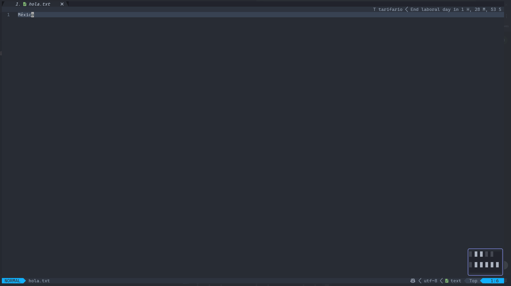

# rssfeed.nvim

```txt
=======================
┳┓┏┓┏┓┏┓┏┓┏┓┳┓ ┳┓┓┏┳┳┳┓
┣┫┗┓┗┓┣ ┣ ┣ ┃┃ ┃┃┃┃┃┃┃┃
┛┗┗┛┗┛┻ ┗┛┗┛┻┛•┛┗┗┛┻┛ ┗
=======================
```



## Introduction

`rssfeed.nvim` is a Neovim plugin that allows you to fetch and display RSS feeds directly within Neovim. This plugin provides an easy way to stay updated with your favorite blogs and news sources without leaving your editor.

## Features

- Fetch and display RSS feeds in a floating window.
- Open links in your default browser.
- Integration with Telescope for selecting feeds.
- Customizable feed list.
- Enhanced interface built with [nui.nvim](https://github.com/MunifTanjim/nui.nvim).

## Installation

### Using `vim-plug`

Add the following to your `init.vim` or `init.lua`:

```vim
Plug "MunifTanjim/nui.nvim"
Plug "4DRIAN0RTIZ/rssfeed.nvim"
```

Then, install the plugin whith:

```vim
:PlugInstall
```

### Using Packer

```lua
use {
    "4DRIAN0RTIZ/rssfeed.nvim",
    requires = "MunifTanjim/nui.nvim",
}
```

Then, install with:

```lua
PackerInstall
```

## Setup

### LUA

```lua
require('rssfeed').setup({
    open_cmd = "wslview",
    feeds = {
        { name = "Dotfyle", url = "https://dotfyle.com/neovim/plugins/rss.xml" },
        { name = "La Cueva del NeanderTech", url = "https://neandertech.netlify.app/blog/rss.xml" },
        { name = "HackerNews", url = "https://hnrss.org/frontpage" },
        { name = "Dev.to", url = "https://dev.to/feed" },
        { name = "El Financiero", url = "https://www.elfinanciero.com.mx/arc/outboundfeeds/rss/?outputType=xml" },
        { name = "GenBeta", url = "https://www.genbeta.com/tag/desarrollo/rss2.xml" },
        { name = "TechCrunch", url = "https://techcrunch.com/feed/" },
        { name = "Smashing Magazine", url = "https://www.smashingmagazine.com/feed/" },
        { name = "CSS Tricks", url = "https://css-tricks.com/feed/" },
        { name = "HiperTextual", url = "https://hipertextual.com/feed" },
        { name = "UnoCero", url = "https://www.unocero.com/feed/" },
    }
})
```

### VimScript

```vim
lua << EOF
require('rssfeed').setup({
    open_cmd = "wslview",
    feeds = {
        { name = "Dotfyle", url = "https://dotfyle.com/neovim/plugins/rss.xml" },
        { name = "La Cueva del NeanderTech", url = "https://neandertech.netlify.app/blog/rss.xml" },
        { name = "HackerNews", url = "https://hnrss.org/frontpage" },
        { name = "Dev.to", url = "https://dev.to/feed" },
        { name = "El Financiero", url = "https://www.elfinanciero.com.mx/arc/outboundfeeds/rss/?outputType=xml" },
        { name = "GenBeta", url = "https://www.genbeta.com/tag/desarrollo/rss2.xml" },
        { name = "TechCrunch", url = "https://techcrunch.com/feed/" },
        { name = "Smashing Magazine", url = "https://www.smashingmagazine.com/feed/" },
        { name = "CSS Tricks", url = "https://css-tricks.com/feed/" },
        { name = "HiperTextual", url = "https://hipertextual.com/feed" },
        { name = "UnoCero", url = "https://www.unocero.com/feed/" },
    }
})
EOF
```

## Commands

```lua
:RSSFeed
```

## Key Mappings

You can set up custom key mappings to use the plugin functionalities:

```lua
nnoremap <leader>rss :lua require('rssfeed').select_feed()<CR>
```

## License

This plugin is licensed under the MIT License. See the LICENSE file for details.

## Contributing

Contributions are welcome! Feel free to open an issue or submit a pull request.
